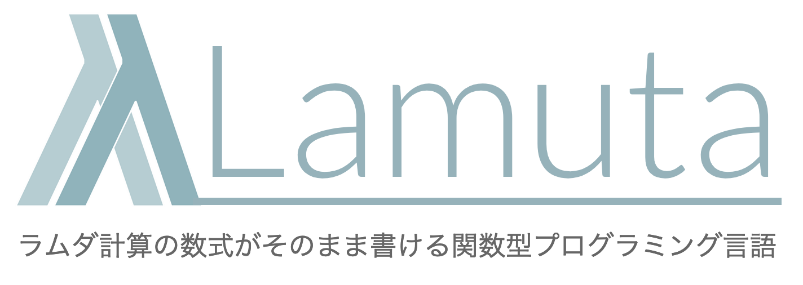

# 

ラムダ計算の数式がそのまま書ける関数型プログラミング言語

> [!IMPORTANT]
> 未踏事業にエントリーしました。
> 採択されるように提案頑張ります！

## ビジョン「ラムダ計算の一般化」
- 学術的要素の強いラムダ計算を、人々の身近な存在にする
- 美しいコードが書ける自由度と表現力の高い言語にする

---

リンク：
　[実装](src/main.rs)
　[サンプルコード](/example)
　[議論](https://github.com/KajizukaTaichi/lamuta/discussions/)
　[Discord](https://discord.gg/qWnHhjpzm4)

&copy; 2024-2025 梶塚太智. All rights reserved
